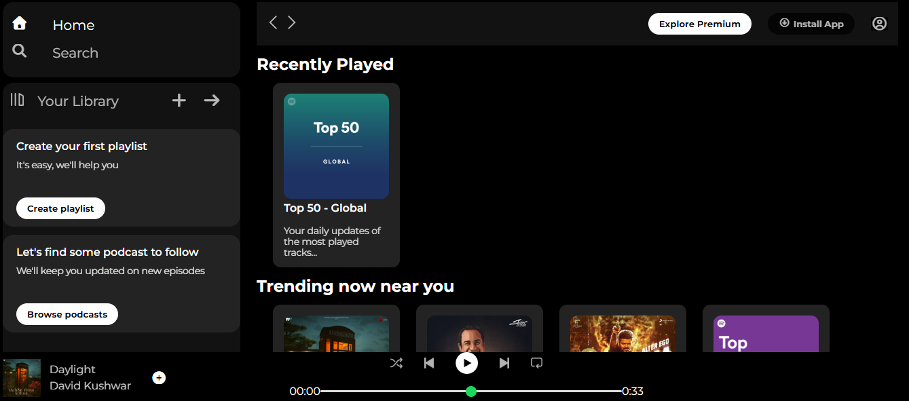

# Spotify UI Clone 🎵

A simple Spotify UI clone built using HTML and CSS only.
This project was created for practice to improve CSS layout, Flexbox, and UI structuring skills.

## Features
- Navigation bar similar to Spotify
- Sidebar layout
- Clean and minimal UI
- Built using only HTML and CSS

## Tech Stack
- HTML5
- CSS3 (Flexbox)

## Preview

## Purpose
This project is for learning and practice only.
It does not include any backend or music functionality.

## Status
Completed (UI only)
